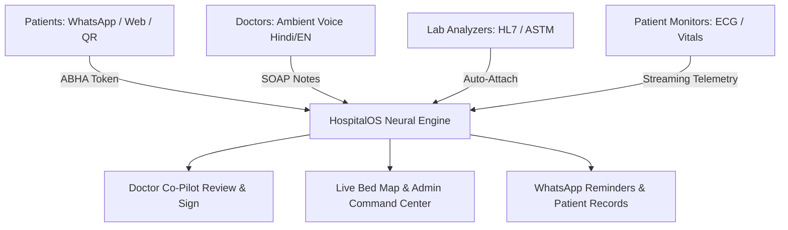

# HospitalOS — India's AI Hospital Operating System

> **One AI brain for every patient, every doctor, every machine in your hospital.**

[](https://clientwise.tech)
[](LICENSE)
[](https://nextjs.org)
[](#security--dpdp-compliance)

HospitalOS is an open-source, AI-first platform for hospital operations in India: unified patient and doctor workflows, medical device integration (HL7/ASTM/DICOM), and AI-driven ops. Built as an early-stage developer platform offering hosted cloud services for healthcare.

Founded and built in the open by **Agam Singh** ([@DreamFaang78](https://github.com/DreamFaang78)).

---

## ⚡ The Four Superpowers

1. **Patient Journey Manager**: WhatsApp & web booking, paperless ABHA QR check-in, live queue wait estimates, multilingual follow-ups.
2. **Doctor AI Co-Pilot**: Ambient Hindi & English voice-to-notes, structured SOAP clinical notes, investigation suggestions. AI drafts, clinician signs.
3. **Machine Integration Hub**: Connects lab analyzers (HL7 / ASTM), bedside vitals monitors, and DICOM imaging directly into the chronological patient record.
4. **AI Ops Command Center**: Real-time bed grid, doctor load balancing, appointment no-show prediction, and administrative briefings.

---

## 🏛️ System Architecture



---

## 🚀 Quickstart (Local Development)

```bash
# Clone the repository
git clone https://github.com/DreamFaang78/cautious-memory.git
cd cautious-memory

# Install dependencies
npm install

# Start development server
npm run dev
```

Open [http://localhost:3000](http://localhost:3000) in your browser.

---

## 📚 Developer SDK & Device Feeds

See our full developer documentation at [`/docs`](https://clientwise.tech/docs):

```typescript
import { HospitalOSClient } from "@hospitalos/sdk";

const client = new HospitalOSClient({
  facilityId: "IN-UP-KNP-042",
  apiKey: process.env.HOSPITALOS_KEY
});

// Stream lab analyzer events directly into the patient record
client.devices.onLabResult(async ({ barcode, observations }) => {
  const patient = await client.patients.findByBarcode(barcode);
  await client.records.attachLabObservation({
    patientId: patient.id,
    results: observations
  });
});
```

---

## 🗺️ Product Roadmap

- **Now (Active)**: Interactive simulation dashboard, open-source core, pilot clinic discovery outreach.
- **Next (Q1-Q2)**: Patient Journey MVP with WhatsApp check-in, first lab analyzer connector (HL7 / ASTM), ambient voice notes pilot in Hindi and English.
- **Later (Scale)**: Predictive bed capacity models, ML no-show queue backfilling, clinical early warning indicators (post validation).

---

## 🔒 Security & DPDP Compliance

- **Consent-First**: Data collected strictly with verifiable patient consent.
- **Encryption**: AES-256 at rest, TLS 1.3 in transit.
- **Audit Logging**: Immutable cryptographic logs of every clinician view.
- **Human in the Loop**: AI drafts and flags; licensed doctors hold final signing authority.

*HospitalOS assists clinicians and does not diagnose, treat, or replace licensed medical professionals.*

---

## 👨‍💻 Founder

Built by **Agam Singh** (Kanpur, India):
- GitHub: [github.com/DreamFaang78](https://github.com/DreamFaang78)
- LinkedIn: [linkedin.com/in/agam-singh-dev](https://www.linkedin.com/in/agam-singh-dev/)
- X: [@faangagam](https://twitter.com/faangagam)
- Website: [amsh.me](https://amsh.me)

## 📄 License

MIT License. See [LICENSE](LICENSE) for details.
